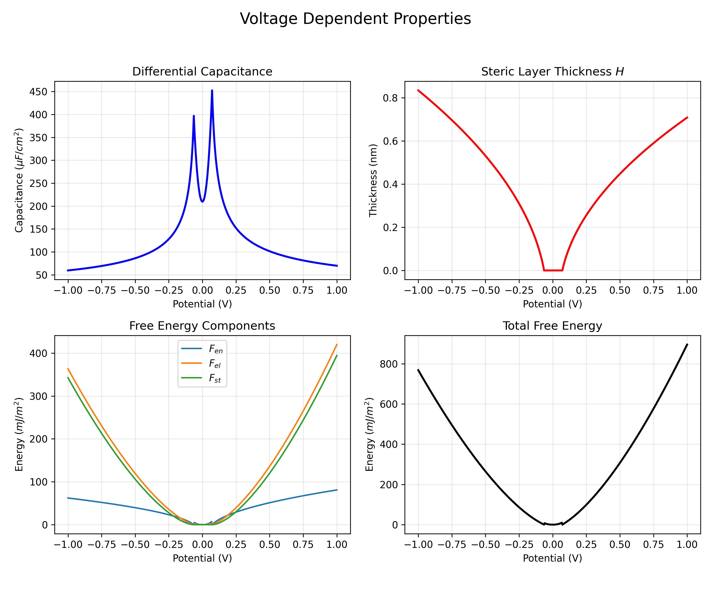
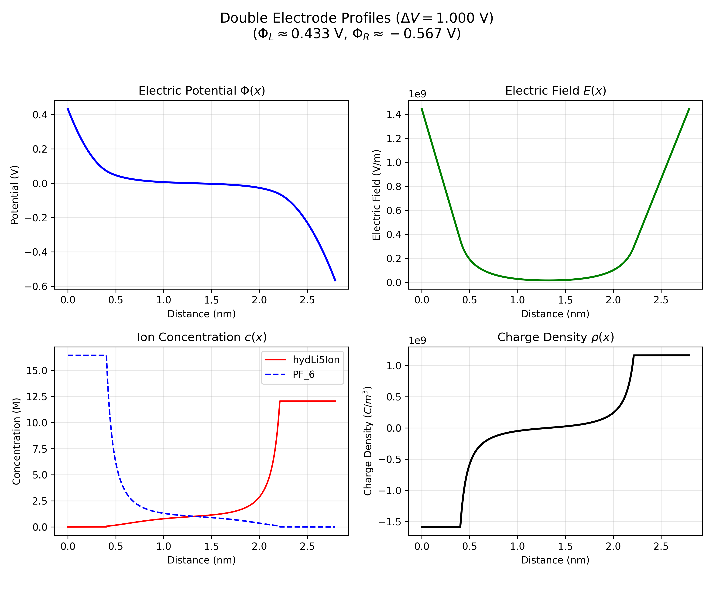

# Composite Diffuse Layer (CDL) Calculator

**CDL (Composite Diffuse Layer)** is a Python package for modeling the electric double layer (EDL) in supercapacitors. It implements a modified Poisson-Boltzmann theory that accounts for steric repulsion (finite ion size) at high potentials, transitioning from Gouy-Chapman behavior at low potentials to a condensed "steric layer" at high potentials.

This repo allows for the calculation of differential capacitance, spatial profiles (potential, electric field, concentration), and thermodynamic properties (free energy components) for both single-electrode (half-cell) and double-electrode (full-cell) configurations.

The model is based on the research article:
> **"The impact of steric repulsion on the total free energy of electric double layer capacitors"**  
> Dagmawi B. Tadesse and Drew F. Parsons  
> *Colloids and Surfaces A: Physicochemical and Engineering Aspects*, 648, 129134 (2022).  
> [DOI: 10.1016/j.colsurfa.2022.129134](https://doi.org/10.1016/j.colsurfa.2022.129134)

## Features

*   **Hybrid Model**: Seamlessly transitions between Gouy-Chapman (diffuse) and Steric (condensed) regimes.
*   **Asymmetric Electrolytes**: Handles ions with different sizes and valencies (e.g., Li+ vs PF6-).
*   **Double Electrode Simulation**: Correctly calculates potential splitting in full cells due to charge conservation and asymmetry.
*   **Thermodynamics**: Computes Entropic, Electrostatic, and Steric free energy components.
*   **Spatial Profiling**: Visualizes potential $\Phi(x)$, electric field $E(x)$, ion concentrations $c(x)$, and charge density $\rho(x)$.
*   **Flexible API**: Use via Command Line Interface (CLI) or as a Python library.

## Installation

### Prerequisites
*   Python 3.10+
*   `uv` (recommended) or `pip`

### Setup

1.  **Clone the repository:**
    ```bash
    git clone https://github.com/daggbt/composite-diffuse-layer-calc.git
    cd composite-diffuse-layer-calc
    ```

2.  **Install dependencies:**
    ```bash
    # Using uv
    uv sync

    # Or using pip
    pip install numpy scipy matplotlib
    ```

## Command Line Interface (CLI)

The `main.py` script provides a robust CLI for running simulations and generating plots.

### 1. Voltage Dependence (Capacitance & Free Energy)
Calculate properties over a voltage sweep.

```bash
# Single Electrode (Half-Cell)
uv run main.py --single-electrode --plot-voltage-dep --output capacitance_curve.png

# Double Electrode (Full-Cell)
uv run main.py --double-electrode --plot-voltage-dep --output full_cell_capacitance.png
```

**Options:**
*   `--cation`, `--anion`: Select ions (e.g., `Li`, `K`, `PF_6`, `Cl`, `TFSI`).
*   `--solvent`: Select solvent (e.g., `Propylene_Carbonate`, `Water`).
*   `--conc`: Bulk concentration in M (default: 1.0).
*   `--v-min`, `--v-max`: Voltage sweep range in mV.


*Figure 2: Voltage dependence of Differential Capacitance, Steric Layer Thickness, and Free Energy components.*

### 2. Spatial Profiles
Visualize the structure of the double layer at a specific potential.

```bash
# Plot profiles at 1000 mV (1 V)
uv run main.py --double-electrode --plot-profiles --potential 1000 --output profiles.png
```


*Figure 1: Spatial profiles of Potential, Electric Field, Concentration, and Charge Density in a double electrode setup.*

## Python API

For advanced usage, integration, or batch processing, use the `cdl` package directly. The `cdl.calculations` module provides high-level access to physical quantities.

### Initialization

```python
from cdl.models import SimulationParameters
from cdl.database import IONS, SOLVENTS

# Define system parameters
params = SimulationParameters(
    electrolyte_ions=(IONS['Li'], IONS['PF_6']),
    solvent=SOLVENTS['Propylene_Carbonate'],
    bulk_concentration=1.0,          # 1 M
    single_electrode=False,          # Double electrode (Full cell)
    separation_distance=20.0         # 20 * Debye Length
)
```

### Calculating Spatial Properties
Get values at a specific distance $x$ (meters) from the left electrode.

```python
from cdl.calculations import (
    get_potential_at_x, 
    get_electric_field_at_x, 
    get_concentration_at_x
)

V_cell = 1000.0 # 1 V potential difference
x_pos = 1e-9    # 1 nm

# Electric Potential (V)
phi = get_potential_at_x(params, x_pos, V_cell)

# Electric Field (V/m)
E_field = get_electric_field_at_x(params, x_pos, V_cell)

# Ion Concentrations (M)
concs = get_concentration_at_x(params, x_pos, V_cell)
print(f"Li+: {concs['cation']} M, PF6-: {concs['anion']} M")
```

### Calculating Macroscopic Properties
Get properties as a function of applied voltage $V$.

```python
from cdl.calculations import (
    get_total_capacitance, 
    get_free_energy, 
    get_potential_split
)

# Total Differential Capacitance (F/m^2)
C_diff = get_total_capacitance(params, V_cell)

# Free Energy Components (J/m^2)
energies = get_free_energy(params, V_cell)
print(f"Total Energy: {energies['total']} J/m^2")
print(f"Steric Contribution: {energies['steric']} J/m^2")

# Potential Drop across Electrodes (mV)
phi_left, phi_right = get_potential_split(params, V_cell)
print(f"Left Electrode: {phi_left} mV, Right Electrode: {phi_right} mV")
```

## Configuration

You can modify default simulation parameters in `config.py` or override them via CLI arguments.

```python
# config.py
CATION = "Li"
ANION = "PF_6"
SOLVENT = "Propylene_Carbonate"
BULK_CONCENTRATION = 1.0
SINGLE_ELECTRODE = False
```

## Citation

If you use this repo in your research, please cite the following article:

```bibtex
@article{TADESSE2022129134,
title = {The impact of steric repulsion on the total free energy of electric double layer capacitors},
journal = {Colloids and Surfaces A: Physicochemical and Engineering Aspects},
volume = {648},
pages = {129134},
year = {2022},
issn = {0927-7757},
doi = {10.1016/j.colsurfa.2022.129134},
url = {https://www.sciencedirect.com/science/article/pii/S0927775722008895},
author = {Dagmawi B. Tadesse and Drew F. Parsons},
keywords = {Supercapacitor, Electric double layer capacitor, Modified Poisson-Boltzmann, Steric interaction, Steric layer, Composite diffuse layer, Total Free Energy},
abstract = {We present an analysis of the total free energy of a supercapacitor modelled with a composite diffuse layer (CDL) formed by a steric repulsive potential. The steric potential is modelled with a simple approximation to the Bikerman steric potential, enabling derivation of an analytical expression for the total free energy of the supercapacitor in terms of the size and valency of the electrolyte counterions and electrode potentials. The analytical expression for the total free energy of the supercapacitor matches the exact numerical Bikerman calculation at high potential with relative error close to 1%. This provides an upper bound over the more accurate Carnahan-Starling model. A maximum upper bound for the energy is also provided in the limit where bulk concentrations approach the ion concentration cap. We analyze the relative contribution of the steric interaction to the total free energy. At large voltages, the steric free energy is comparable in magnitude to that of the electrostatic free energy, and introduces ion-size effects in the energy of the supercapacitor. Consequently at high potentials the total free energy exceeds (doubles) the classical energy 1/2CV^2, indicating that this formula does not correctly describe the available stored energy from the experimentally measured capacitance.}
}
```

## License

[MIT License](LICENSE)

```bash
uv run main.py --cation Li --anion PF_6 --solvent Propylene_Carbonate --output result.png
```

### Command Line Arguments

| Argument | Description | Default |
| :--- | :--- | :--- |
| `--cation` | Name of the cation (e.g., `Li`, `Na`, `K`) | `hydLi5Ion` |
| `--anion` | Name of the anion (e.g., `PF_6`, `Cl`) | `PF_6` |
| `--solvent` | Name of the solvent | `Propylene_Carbonate` |
| `--conc` | Bulk concentration in Molar (mol/L) | `1.0` |
| `--v-min` | Minimum voltage in mV | `-1000` |
| `--v-max` | Maximum voltage in mV | `1000` |
| `--steps` | Number of voltage steps | `100` |
| `--single-electrode` | Simulate a single electrode instead of a full cell | `False` |
| `--output` | Path to save the resulting plot (e.g., `plot.png`) | None (shows plot) |

### Available Ions and Solvents

Check `src/cdl/database.py` for the full list of available ions and solvents. Common options include:
*   **Cations**: `Li`, `Na`, `K`, `hydLi5Ion`, `EM`
*   **Anions**: `PF_6`, `BF_4`, `ClO_4`, `TFSI`, `Cl`
*   **Solvents**: `Propylene_Carbonate`, `Water`

## Project Structure

The codebase has been refactored for modularity and maintainability:

```
composite-diffuse-layer-calc/
├── src/
│   └── cdl/
│       ├── models.py       # Data structures (Ion, Solvent, SimulationParameters)
│       ├── physics.py      # Core physics calculations (Debye length, etc.)
│       ├── solvers.py      # Numerical solvers for potential and capacitance
│       └── database.py     # Registry of ion and solvent properties
├── tests/                  # Unit tests
├── main.py                 # CLI entry point
└── pyproject.toml          # Project configuration
```

## Development

To run the unit tests:

```bash
uv run pytest
```
